# 5G Wearable MIMO Antenna with AMC-FSS Shielding

CST simulation study — no fabrication. A 2×2 MIMO planar monopole antenna system designed for the 3.5 GHz 5G n78 band, integrated with a 3×3 Artificial Magnetic Conductor (AMC) Frequency Selective Surface for on-body SAR suppression and radiation efficiency recovery.

---

## Motivation

Wearable 5G devices place radiating elements directly against biological tissue. Without shielding, the antenna couples significant power into the body — raising SAR beyond safe limits and collapsing radiation efficiency. This study investigates whether an AMC-FSS layer inserted between the antenna and body can simultaneously solve both problems at 3.5 GHz.

---

## System Architecture

A 4-layer stack-up, top to bottom:

| Layer | Component | Material | Thickness |
|-------|-----------|----------|-----------|
| 1 | 2×2 MIMO antenna | Polyimide substrate | 0.1 mm |
| 2 | Isolation spacer | Air / foam | 4 mm |
| 3 | AMC-FSS shield | FR-4 substrate | 1.6 mm |
| 4 | Body phantom | Skin + Fat + Muscle | — |

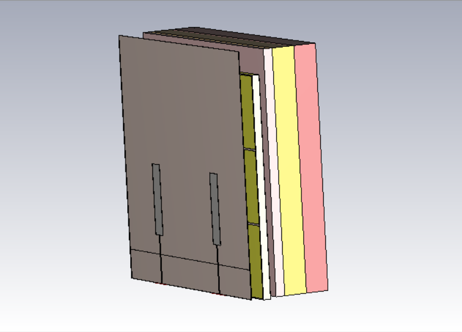

---

## FSS / AMC Unit Cell Design

The FSS is a periodic square patch array tuned so its reflection phase crosses 0° at exactly 3.5 GHz. At this condition the surface behaves as an Artificial Magnetic Conductor — reflected waves add constructively with direct radiation instead of cancelling it.

- Unit cell dimensions: 15.1 × 15.1 mm
- Copper patch: 14.75 × 14.75 mm
- Substrate: FR-4, εr = 4.3, 1.6 mm thick

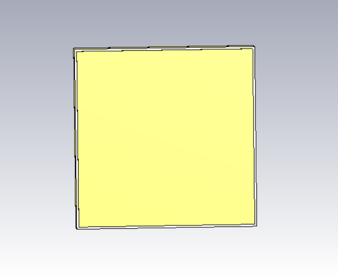

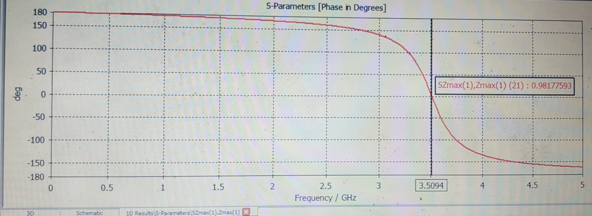

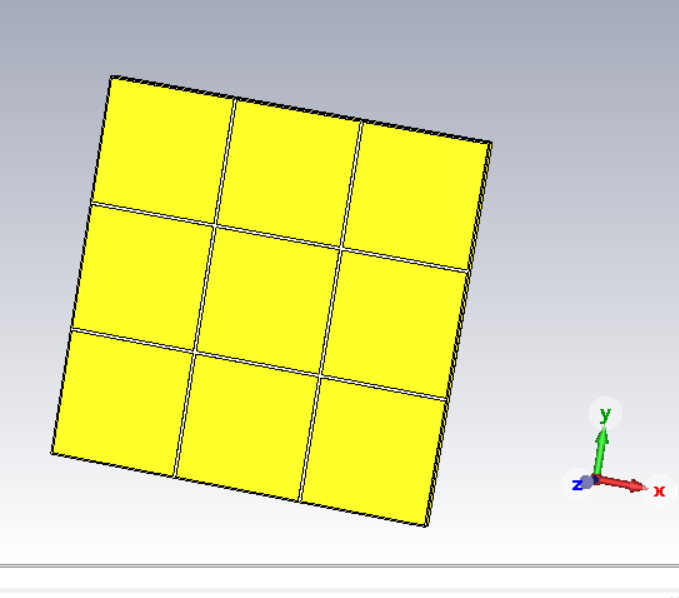

---

## MIMO Antenna Design

A 2×2 array of planar monopoles on a 50 × 50 mm flexible polyimide substrate. The thin substrate keeps the assembly conformal to curved body surfaces.

- Overall footprint: 50 × 50 mm
- Substrate: Polyimide, εr = 3.5, 0.1 mm thick
- Radiator length (Lpatch): 14.5 mm
- Feed line width (Wfeed): 0.25 mm

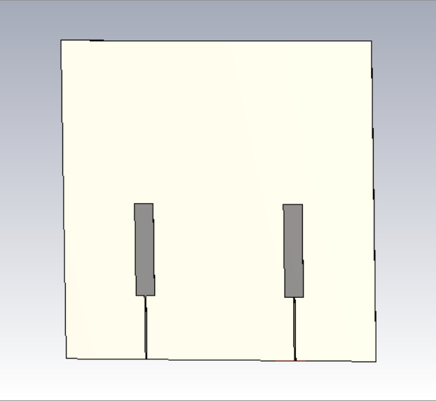

---

## Tissue Phantom Model

A 3-layer heterogeneous phantom representing the human forearm was used for all on-body simulations. Dielectric properties were assigned at 3.5 GHz per IEEE/IEC standards.

| Layer | εr | σ (S/m) |
|-------|----|---------|
| Skin | 37.9 | 1.49 |
| Fat | 5.28 | 0.10 |
| Muscle | 53.6 | 1.74 |

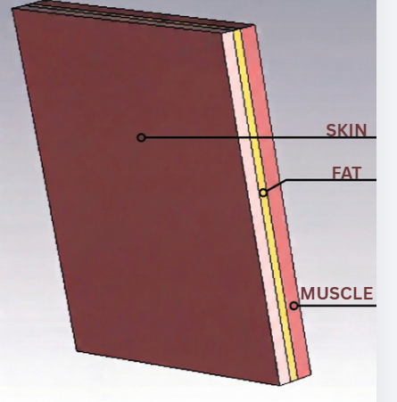

---

## S-Parameter Results

### Free Space

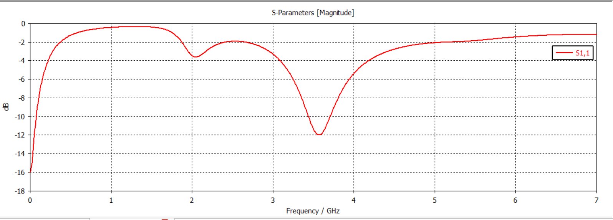

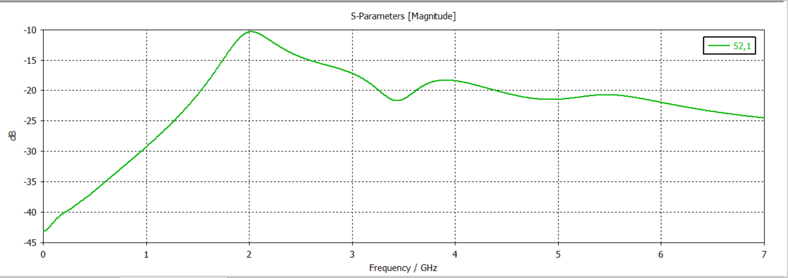

### On-Body with AMC-FSS

| Parameter | Value |
|-----------|-------|
| S11 | −17.98 dB |
| S21 (isolation) | −13.7 dB |

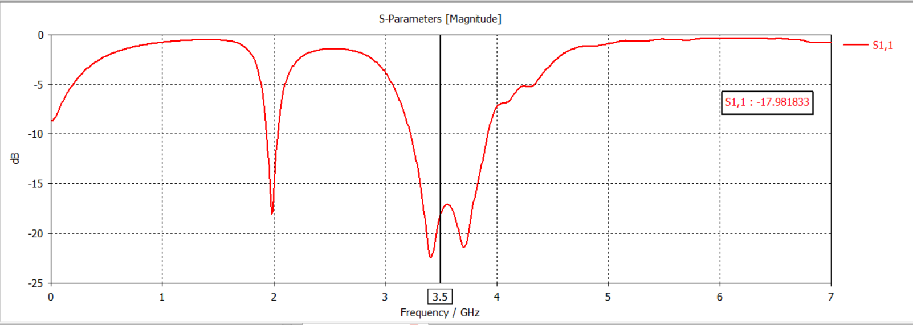

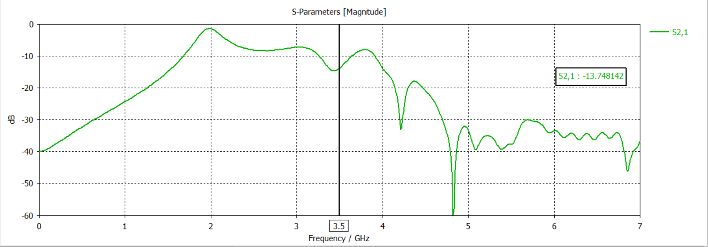

---

## SAR Analysis (10g averaged)

The SAR comparison below uses an identical colour scale across both simulations. The AMC-FSS reduces the power deposited into tissue by redirecting backward radiation outward.

| Condition | SAR (10g) | vs. CE limit (2.0 W/kg) |
|-----------|-----------|--------------------------|
| Without FSS | 8.41 W/kg | 4.2× over limit |
| With AMC-FSS | 0.295 W/kg | 6.8× under limit |

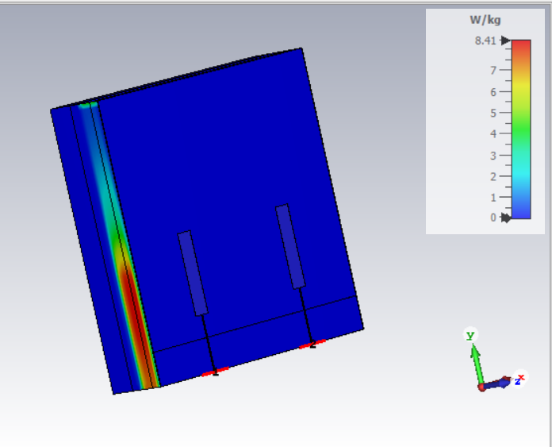

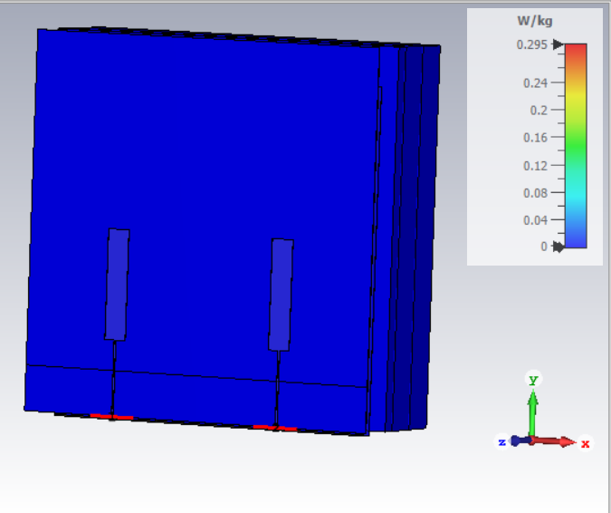

---

## Radiation Performance

| Metric | Value |
|--------|-------|
| Directivity | 6.78 dBi |
| Radiation efficiency (with FSS) | ~75% / −1.23 dB |
| Radiation efficiency (without FSS) | ~2% |

The AMC surface converts a near-useless on-body antenna (2% efficiency) into a viable 5G front-end (75% efficiency) by suppressing the body-directed power and reinforcing the outward beam.

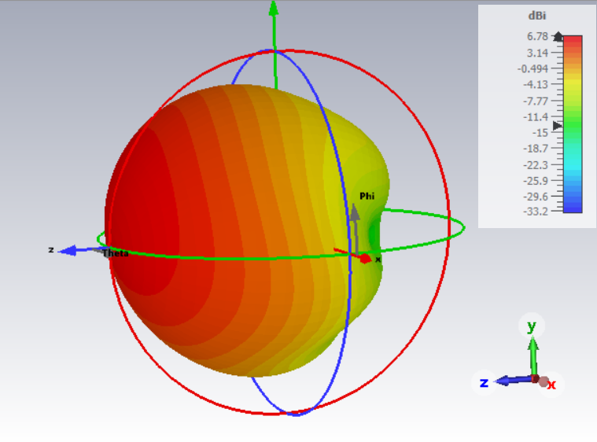

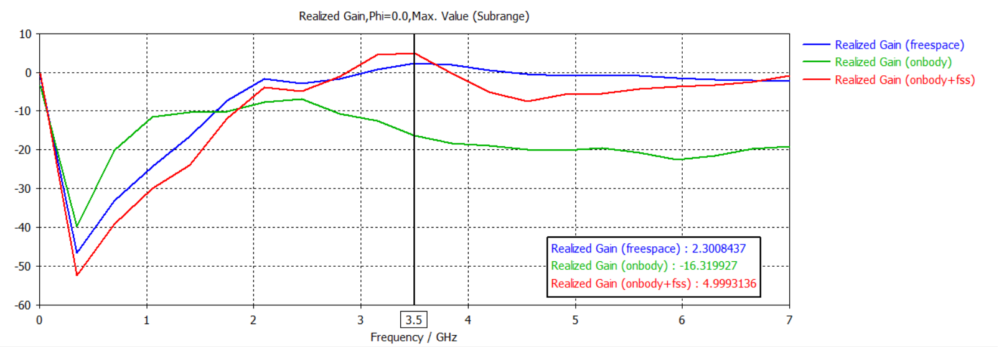

---

## Key Takeaways

- AMC-FSS reduced SAR from 8.41 W/kg to 0.295 W/kg — a 96.5% reduction, comfortably within the 2.0 W/kg CE commercial safety limit
- Radiation efficiency recovered from ~2% to ~75% — a 37× improvement
- S11 of −17.98 dB confirms excellent impedance matching on-body at 3.5 GHz
- Port isolation of −13.7 dB is acceptable for a 2×2 MIMO configuration at this frequency

---

## Tools

- **CST Studio Suite** — full-wave FEM/FIT simulation, parametric sweeps, SAR post-processing
- **Simulation type:** Frequency domain solver, 3.5 GHz band

---

## Author

**Vaishakh S**
BTech ECE, Government College of Engineering Kannur, Kerala (2026)
[LinkedIn](https://linkedin.com/in/vaishakhs2004) · [GitHub](https://github.com/vaishakh4002) · vaishakhedavalath@gmail.com
